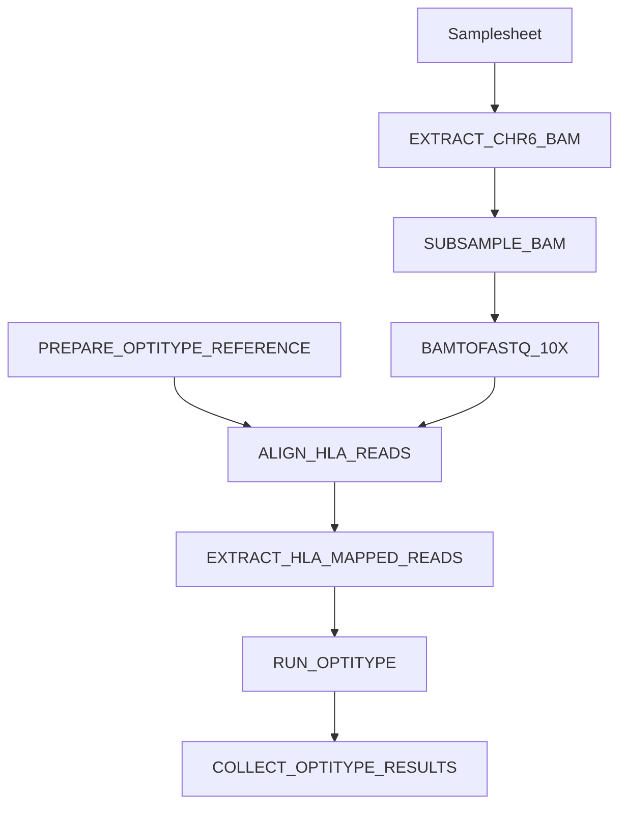

# OptiType workflow

This document describes the OptiType-specific workflow implemented in this pipeline.

## Workflow DAG



## Steps

### `EXTRACT_CHR6_BAM`

Extracts chromosome 6 reads from the input BAM file.

The process detects whether the BAM uses `chr6` or `6` as chromosome naming.

### `SUBSAMPLE_BAM`

Subsamples the chromosome 6 BAM to reduce runtime and disk usage.

The subsampling fraction is controlled by:

```groovy
params.subsample_fraction
```

The random seed is controlled by:

```groovy
params.subsample_seed
```

### `BAMTOFASTQ_10X`

Converts the subsampled BAM to FASTQ using 10X Genomics `bamtofastq`.

The OptiType workflow keeps the R2 FASTQ reads.

### `PREPARE_OPTITYPE_REFERENCE`

Copies the OptiType HLA RNA reference FASTA from the OptiType container.

### `ALIGN_HLA_READS`

Aligns the R2 FASTQ reads to the OptiType HLA RNA reference using BWA.

This is the first part of the HLA read fishing step.

### `EXTRACT_HLA_MAPPED_READS`

Keeps reads that mapped to the HLA RNA reference and writes them back to FASTQ using samtools.

This is the second part of the HLA read fishing step.

The fishing step is split into two processes because BWA and samtools are provided by different containers.

### `RUN_OPTITYPE`

Runs OptiType in RNA mode on the HLA-fished FASTQ file.

Each sample produces:

```text
<sample_id>_result.tsv
```

### `COLLECT_OPTITYPE_RESULTS`

Runs the custom Bash script:

```text
bin/collect_optitype_results.sh
```

This combines all per-sample OptiType result files into:

```text
combined_optitype_results.tsv
```