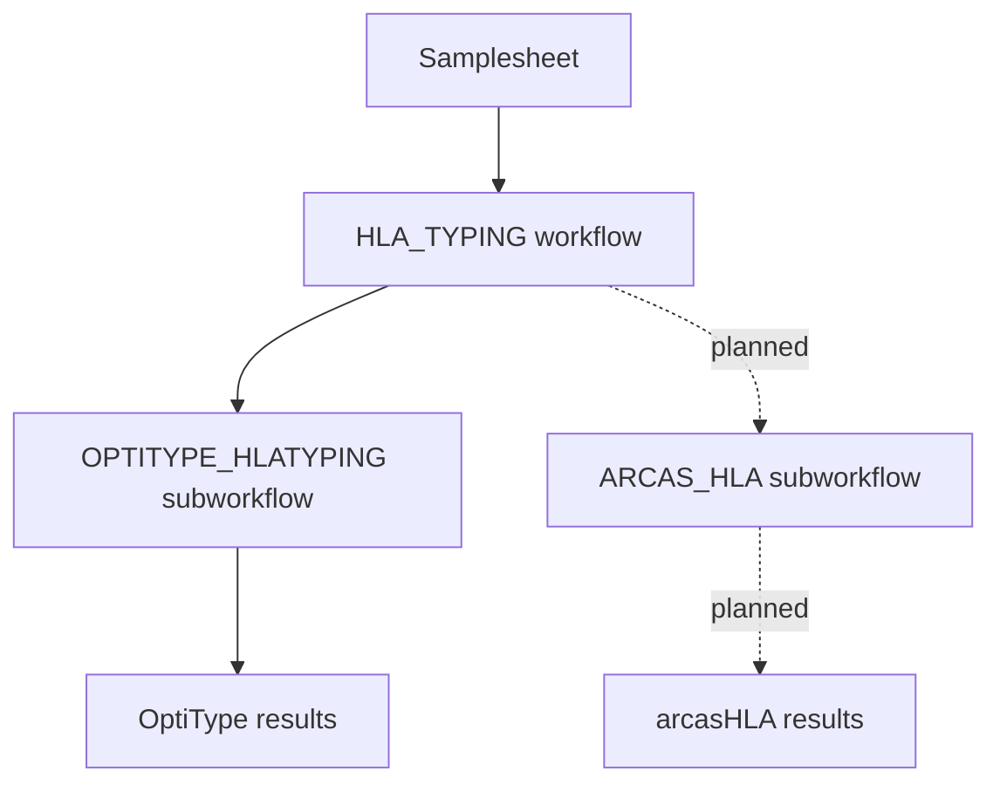

# Workflow overview

This document gives a high-level overview of the HLA typing pipeline.

The main README contains the basic usage instructions. This document focuses on how the workflow is organised and where individual HLA typing methods fit into the pipeline.

## Workflow structure

The pipeline is organised into a main workflow, a general HLA typing workflow, method-specific subworkflows, and local modules.

```text
main.nf
workflows/hla_typing.nf
subworkflows/
modules/local/
```

The main workflow reads the input samplesheet and passes the samples to the general HLA typing workflow.

The general HLA typing workflow is intended to coordinate one or more HLA typing methods. At the moment, the implemented method is **OptiType**. Additional methods, such as **arcasHLA**, can be added later as separate subworkflows.

## High-level workflow DAG



## Implemented methods

| Method | Status | Documentation |
|---|---|---|
| OptiType | Implemented | [`optitype_workflow.md`](optitype_workflow.md) |
| arcasHLA | Planned | Not implemented yet |

## File organisation

The current workflow files are organised as follows:

```text
main.nf
workflows/
└── hla_typing.nf
subworkflows/
└── optitype_hlatyping.nf
modules/
└── local/
    └── optitype/
        ├── preprocessing.nf
        ├── optitype.nf
        └── postprocessing.nf
bin/
└── collect_optitype_results.sh
```

## Main workflow

The `main.nf` file is the pipeline entry point.

It performs three main tasks:

1. Optionally prepares the test data when the test profile is used.
2. Reads the input samplesheet.
3. Sends the parsed samples to the general HLA typing workflow.

The samplesheet is converted into tuples containing:

```text
sample metadata
BAM file
BAM index file
```

## General HLA typing workflow

The general workflow is defined in:

```text
workflows/hla_typing.nf
```

This workflow currently calls the OptiType subworkflow.

Later, this workflow can be extended to call additional HLA typing methods, such as arcasHLA, and combine or compare their outputs.

## Method-specific subworkflows

Method-specific workflows are placed in:

```text
subworkflows/
```

The current implemented subworkflow is:

```text
subworkflows/optitype_hlatyping.nf
```

This subworkflow contains the OptiType-specific processing chain.

Detailed documentation for the OptiType workflow is available in:

```text
docs/optitype_workflow.md
```

## Local modules

Local modules are placed in:

```text
modules/local/
```

The OptiType modules are grouped in:

```text
modules/local/optitype/
```

These modules contain the individual Nextflow processes used for preprocessing, running OptiType, and collecting results.

## Custom script

The pipeline includes a custom Bash script:

```text
bin/collect_optitype_results.sh
```

This script combines the per-sample OptiType result files into one combined results table.

## Future extensions

The structure is designed so that additional HLA typing methods can be added without rewriting the existing OptiType workflow.

For example, arcasHLA could later be added as:

```text
subworkflows/arcas_hla_typing.nf
modules/local/arcas_hla/
docs/arcas_hla_workflow.md
```

The general `HLA_TYPING` workflow can then be updated to call both OptiType and arcasHLA.